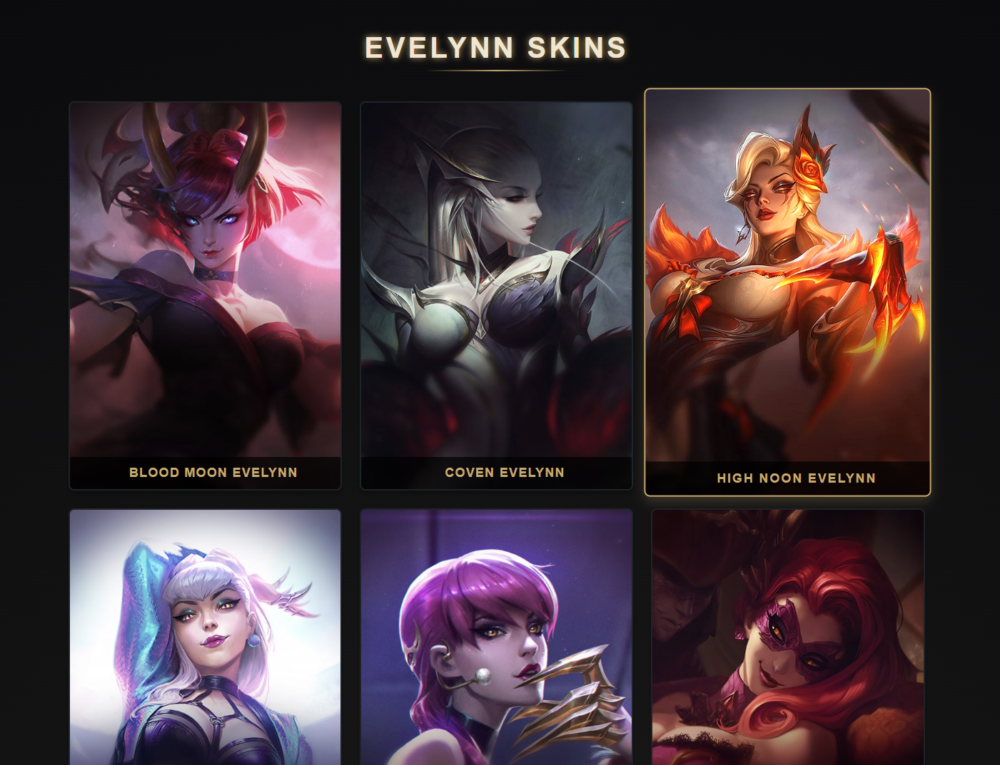
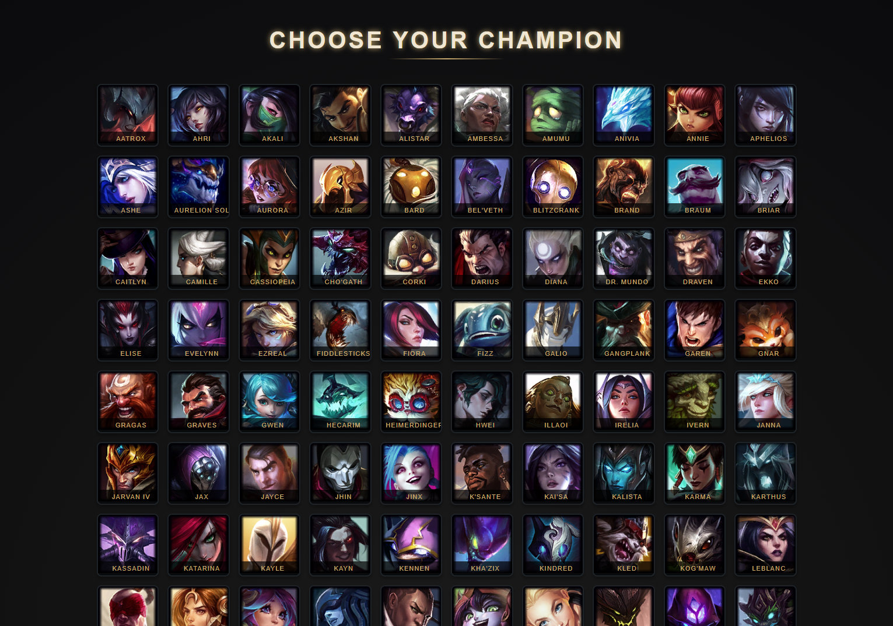

# LoL Skin Switcher

LoL Skin Switcher is a free, easy-to-use tool for previewing and applying skins in League of Legends. Quickly browse and switch between a vast collection of skins for your favorite champions.

**Features:**

*   **Extensive Skin Preview:** View almost every skin in the game before applying.
*   **Intuitive Navigation:** Easily find and select skins with a user-friendly interface.
*   **Safe to Use:** Designed with safety and account security in mind.
*   **Completely Free:** Open-source and available at no cost.
*   **Easy Skin Application:** Simple drag-and-drop for applying skins.

**How to Use:**

1.  Download the latest release - https://github.com/ThetaCursed/lol-skin-switcher/releases
2.  Follow the instructions in the video
(https://img.youtube.com/vi/nqt23wCpNoI/0.jpg)(https://www.youtube.com/watch?v=nqt23wCpNoI)

**Disclaimer:**

*   This tool is for applying skins and is not affiliated with Riot Games.
*   Ensure you understand and comply with Riot Games' Terms of Service.

**Used Repositories:**

*   Skin files are taken from here - https://github.com/darkseal-org/lol-skins
*   Activation and integration of skins into the game - https://github.com/LeagueToolkit/cslol-manager
*   Splash art and champion icons are taken from here - https://raw.communitydragon.org/latest/plugins/rcp-be-lol-game-data/
